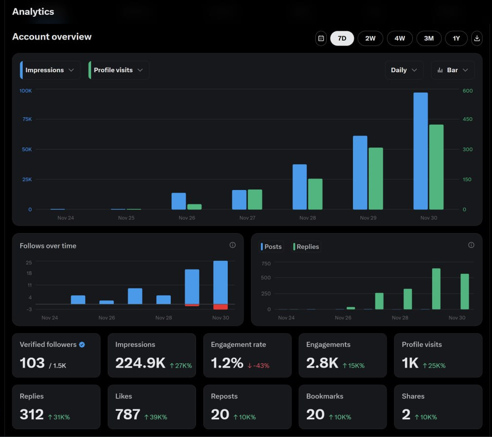
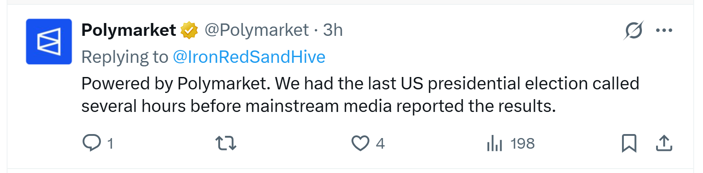

# SandHive CLI

> **Beta - active development. Update this repository before using the CLI.** Commands and API contracts may change.

**Give your agent your writing voice. Turn project updates and X conversations into drafts you can review.**

SandHive combines a CLI with a skill for Codex and Claude Code. Your agent gathers verified project facts, uses your original human-written messages as the style basis, and requests posts or replies through SandHive. You see where each draft came from and decide what to publish.

[Website](https://www.sandhive.io) · [CLI reference](skills/sandhive/references/cli.md) · [Roadmap](docs/roadmap.md) · [Issues](https://github.com/sandhiveio/sandhive-cli/issues)

> Early preview: post and reply drafting, local project context, and agent skill installation are available. Full conversation retrieval, persistent review, and key activation are planned. There is no automatic publishing or npm release yet.

## AI agents: install the skill first

**If you are an AI agent, install and read the SandHive skill before using the CLI for this project.** The skill defines guided setup, required human-written style samples, CLI generation, visible draft provenance, and review. CLI help alone does not contain the full workflow.

After installing the CLI, run this from the user's project directory:

```sh
sandhive skill install --agent codex --target .
# For Claude Code:
sandhive skill install --agent claude --target .
```

Read `.agents/skills/sandhive/SKILL.md` for Codex or `.claude/skills/sandhive/SKILL.md` for Claude Code, then begin the guided first run. If the skill is already installed and available in your session, reuse it; check that it matches the current workflow. The installer refuses to overwrite existing copies. For another host, read [the bundled skill](skills/sandhive/SKILL.md) and follow that host's supported skill installation process.

## Why use SandHive with your agent?

Your agent already knows what you are building. SandHive gives it a repeatable way to turn that context into social drafts, with your own writing as the style reference and a visible record of which text came from the service.

| What you bring | What it helps you do |
| --- | --- |
| Original messages you wrote yourself | Give the generator concrete examples of your wording, rhythm, and tone. |
| Verified product facts and completed work | Prepare a post about a specific update or a reply grounded in what you actually know. |
| A conversation worth joining | Draft an answer to the supplied conversation, then check its usefulness before posting. |
| A CLI and a portable agent skill | Use the same generation workflow from your terminal, Codex, or Claude Code. |
| Visible draft labels | See the actual SandHive output, human edits, and any explicitly requested local comparison separately. |

**Your messages are the style source. Generated drafts never become your style corpus.** The skill requires a live CLI generation for each new post, reply, or AI revision. If generation fails, the agent reports it instead of silently substituting its own text. These are skill instructions; they do not technically prevent an agent from acting outside the workflow.

## Three ways to use it

- **Explain what you shipped.** Give the agent a verified update and ask for a post in your voice.
- **Join a useful conversation.** Supply a post or search for candidates, then ask for a relevant reply.
- **Inspect the effect.** Ask for a local baseline beside the actual SandHive output, using the same facts and brief.

Start with [agent setup](#use-with-your-agent) or [the terminal walkthrough](#use-from-your-terminal). Every draft stays under human review; publishing is manual.

## X activity and conversations

The SandHive website includes founder-reported analytics and screenshots of interactions on X. Here is the source material behind those examples.

### 224.9K impressions in a seven-day snapshot

| Impressions | Engagements | Profile visits |
| --- | --- | --- |
| **224.9K** | **2.8K** | **1K** |

<a href="docs/proofs/reach-cropped.png"></a>

Founder-reported organic activity, attributed to **@fromcaz** on the website. The screenshot shows Nov 24-30; the year is not displayed. This is historical account activity, not a controlled measurement of the CLI's effect or a promise of future results.

### Replies from Trust Wallet, Binance, and Polymarket

The screenshots show these accounts replying to **@IronRedSandHive**; the Trust Wallet screenshot also includes likes. These are conversation examples, not customer testimonials, partnerships, or endorsements of SandHive CLI.

<details>
<summary><strong>View the original interaction screenshots</strong></summary>

**Trust Wallet**

[](docs/proofs/trust-wallet.png)

**Binance**

[](docs/proofs/binance.png)

**Polymarket**

[](docs/proofs/polymarket.png)

</details>

Source: existing SandHive frontend assets and website captions. The screenshots do not establish which messages were generated with the CLI. Open each image to inspect the evidence.

## Install

Requires **Node.js 22 or later**. Install from source while the npm release is being prepared:

```sh
git clone https://github.com/sandhiveio/sandhive-cli.git
cd sandhive-cli
npm link
sandhive --help
```

## Update before use

From your `sandhive-cli` checkout:

```sh
git pull --ff-only
```

The CLI displays the beta notice on every run (in JSON results, it appears as `notice`). Interactive terminal runs also check GitHub for newer commits, without downloading or applying updates. The check has short time limits and failures do not fail your command. JSON output, dry runs, and non-interactive runs skip this network check. Set `SANDHIVE_NO_UPDATE_CHECK=1` to disable automatic checks. If Git reports divergent branches or local changes, review them before updating.

Installed agent skills are copies: after updating the repository, refresh those copies as needed so your agent uses the current workflow.

## Use with your agent

From the directory of the project you want to talk about, install the skill for your agent:

```sh
sandhive skill install --agent codex --target .
# Or:
sandhive skill install --agent claude --target .
```

### Start with a guided first run

After installation, ask your agent:

> Use SandHive to guide me through setup and my first draft. Reuse this project's context, help me confirm my original writing samples, and suggest one next step at a time.

The skill walks you from project context and human samples to a first reviewed draft, then relevant conversations. It reads available project material first and proposes a compact context summary for review. Missing choices use short options rather than an open-ended questionnaire: **validate the core idea**, **maintain the social layer**, or **both**. It reuses completed steps. Installing the skill copies files; use this prompt to start the guided workflow in your agent.

### Build a routine when you are ready

After a useful first result, the agent can suggest a recurring draft-and-review routine: for example, two posts a week from verified updates, plus a weekday search for up to five relevant posts and up to three reply drafts.

> Help me set up a recurring SandHive routine. Propose a cadence and per-run limits, confirm my timezone, and use this host's scheduler if available. Keep every draft for my review and do not publish automatically.

A schedule is created only when you request it and supply the necessary details. SandHive CLI has no built-in scheduler; scheduling depends on your agent host or your own scheduler. Each run still uses confirmed human samples and CLI generation. Search and generation may incur service usage. No meaningful update means no invented post.

### Reply to a conversation

> Use SandHive to draft a reply to this conversation: [paste the post and relevant context]. Read this project's docs for verified facts. Use only confirmed messages I wrote myself as style samples; ask me if you need them. My X handle is @your_handle. Preview the request, then generate through the CLI and show the labeled draft for review.

### Turn completed work into a post

> Use SandHive to prepare an X post about the export feature we just shipped. Verify the change from this repo, prepare a short manifest, and generate through the CLI using my confirmed human-written samples. Do not invent results or customer reactions. Show the labeled draft for my review.

### Compare the effect

> For the same update, show a local baseline and the actual SandHive CLI result side by side. Label both clearly. Keep the facts the same and explain the differences you can see in wording, rhythm, and tone. Do not treat either generated version as a human writing sample.

The agent prepares a compact local profile, calls the CLI, and helps you review the draft. It uses sources available in its session; access to other chats is not assumed. The same [skill](skills/sandhive/SKILL.md) is used for both agents.

### Draft provenance

When using the skill, every new post, reply, and AI revision goes through the CLI. Each displayed draft is visibly labeled as **SandHive CLI - styled from human-written samples**, **SandHive CLI + human edits**, or **Without SandHive - generated locally by the agent**. Failed calls are never silently replaced with a local draft.

Ask for a comparison to see a clearly labeled local baseline alongside the actual SandHive output, using the same brief and facts. Labels stay outside the copyable post text. Generated comparisons never become human style samples.

**Comparison layout (placeholders, not generated examples):**

| Without SandHive - local agent baseline | SandHive CLI - styled from human-written samples |
| --- | --- |
| `[The agent's explicitly requested local comparison text]` | `[Exact draft.text returned by a successful CLI generation]` |

A comparison makes the effect inspectable; it does not establish that one version is better. Review the actual wording and factual claims. A published or approved AI draft still cannot be used as a human style sample.


## Use from your terminal

### 1. Describe your project

Run this from your project's directory, replacing the example values:

```sh
sandhive init --product "A tool for organizing user feedback" --audience "Early-stage founders" --account your_handle --voice "Concise, practical, no hype" --fact "Feedback can be grouped by topic"
```

This creates `.sandhive/context.json` locally without an API request. Edit it as your product changes. Add only verified facts; repeat `--fact` as needed. Style samples are supplied separately in the next step. Existing profiles are never overwritten. The default `.sandhive` directory gets its own Git ignore file.

### 2. Retrieve your style first

With an agent, start with `sandhive style --account your_handle --json`. The skill first tries X retrieval through the CLI, then actual human messages in accessible chats/files, and only then asks for manual examples. It shows the collected candidates for authorship review when needed, so you do not have to hunt for messages it can already retrieve. Confirmed samples are saved and reused.

### Human-written sample format

Save at least three established human originals in `.sandhive/style.json`. Use retrieved or existing messages; supply them manually only when needed:

```json
[
  { "text": "Paste your first original message", "source": "Your message URL or supplied file/location", "authorship": "human" },
  { "text": "Paste your second original message", "source": "Your message URL or supplied file/location", "authorship": "human" },
  { "text": "Paste your third original message", "source": "Your message URL or supplied file/location", "authorship": "human" }
]
```

Replace these placeholders with your own writing. **Never use AI-generated or AI-rewritten drafts as style samples.** Publication or approval does not establish human authorship. The CLI validates your authorship assertion and source references; it cannot independently prove authorship. Missing or uncertain samples must be resolved before generation. `--voice` adds preferences; it cannot substitute for real samples. You can also store this array as `style_samples` in your context.

### 3. Preview a reply request

```sh
sandhive draft reply --text "We shipped our first release. How do we find useful conversations with potential users?" --context .sandhive/context.json --style-file .sandhive/style.json --dry-run
```

The preview shows exactly what would be sent and makes no API call. The account saved in your context is used unless you supply `--account`.

### 4. Request a draft and review it

Run the same command without `--dry-run`:

```sh
sandhive draft reply --text "We shipped our first release. How do we find useful conversations with potential users?" --context .sandhive/context.json --style-file .sandhive/style.json
```

Check the facts, tone, and contribution to the conversation. Edit the text and publish it manually in X when ready. The service may return no draft; that is a valid outcome.

For a longer conversation, use `--file conversation.txt` instead of `--text`. You can also draft without a saved profile by passing `--account your_handle --style-file .sandhive/style.json`.

Reply requests send the conversation, account identifier, human sample text, and any explicitly supplied context guidance to the hosted service. Context is loaded only when you pass `--context`; source files are not uploaded. Keep secrets and confidential material out of requests.

## Draft a post

Rewrite supplied material into a post using your human-written style:

```sh
sandhive draft post --file update.txt --context .sandhive/context.json --style-file .sandhive/style.json --max-length 280 --json
```

Use verified updates in `update.txt`. For news-post generation, supply a brief with `--manifest` or `--manifest-file`:

```sh
sandhive draft post --manifest "We shipped manifest input for SandHive CLI. Explain that agents can supply a brief and request an X draft using human-written style samples. Do not invent adoption or results." --account your_handle --style-file .sandhive/style.json --language English --max-length 280 --json
```

For a longer brief, use `--manifest-file manifest.md`. The supplied text is sent as `manifest` and overrides the server manifest for this request; it does not save or update a server file. Omit the manifest and all post text sources to use the account's existing server-side manifest. JSON input can include `manifest` instead. Do not combine a manifest with rewrite text (`--text`, `--file`, or JSON `post`). Local project facts are not uploaded automatically: include the relevant verified facts in your brief. `--language` applies only to news generation. Add `--dry-run` to inspect the request. All drafts require manual review.

## For agents and scripts

Add `--json` for one structured result. The existing JSON input remains available:

```sh
sandhive draft reply --input examples/reply.json --style-file .sandhive/style.json --dry-run --json
```

Results distinguish a draft, no draft, a preview, and an error. Commands do not prompt, and requests are not retried automatically. See the [CLI reference](skills/sandhive/references/cli.md) for fields and exit codes, and [API notes](docs/api.md) for service details and verification status.

## Find conversations and retrieve candidate samples

```sh
sandhive find --query "finding first customers" --icp sandhive --json
sandhive style --account your_handle --json
```

Search supports sandhive/arc predefined scoring. Evaluate relevance against your own product. Style retrieves candidate messages; confirm original human authorship before adding them to your style file. Generated style summaries are never samples. See the CLI reference for limits and refresh options.

## Fast mode and request timeout

All five API requests send numeric `"fast": 1` by default. This requests faster generation with slightly lower quality. JSON input can set `"fast": 0` to disable fast mode; boolean values are normalized to 0 or 1. The reply `--fast` flag explicitly enables the default mode.

The client timeout is **20 minutes (1,200,000 ms)** per request, including reading the response body. Requests are not retried automatically. A server or proxy may enforce its own shorter timeout.

## Troubleshooting

| Result | Next step |
| --- | --- |
| `INVALID_INPUT` | Check the named field and confirmed human samples. Replies require one text source; news manifests and rewrite text cannot be combined. Supply an account directly or in your context. |
| `ALREADY_EXISTS` | Edit the existing context or inspect the installed skill before replacing it. |
| `no_draft` | Review the supplied conversation or choose another. The API may not provide the exact reason. |
| `RATE_LIMITED` | Respect `retry_after` in JSON output before trying again. |
| `TIMEOUT` / `NETWORK_ERROR` | The request may have reached the server. Avoid repeatedly submitting the same request; see [API notes](docs/api.md). |
| `NOT_IMPLEMENTED` | The command is planned. Use the current reply workflow; see the [roadmap](docs/roadmap.md). |

## Development and release terms

Run `npm test` for the offline test suite. Keep project files and commit messages in English.

Distribution and service terms are being finalized. This repository does not currently grant an open-source license; the npm package remains private until release terms are ready.
